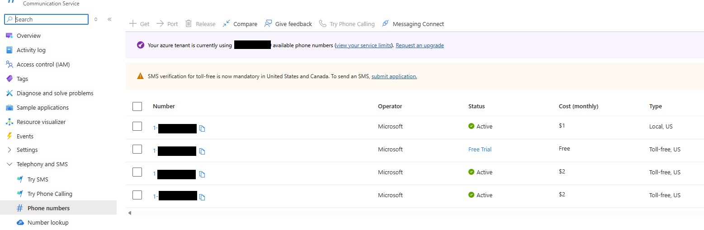
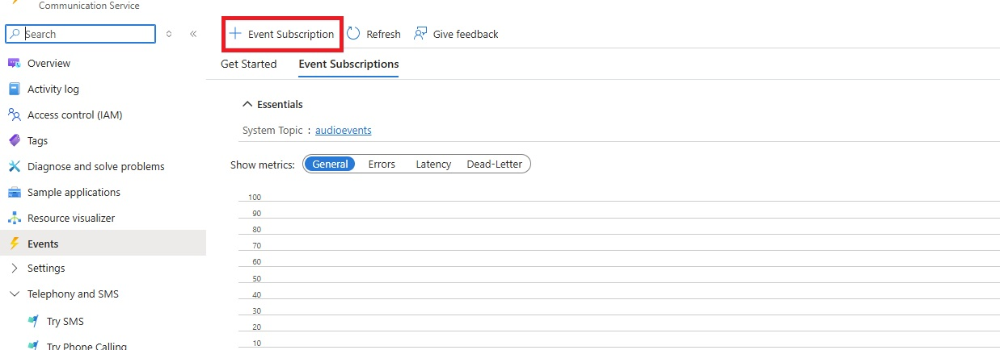
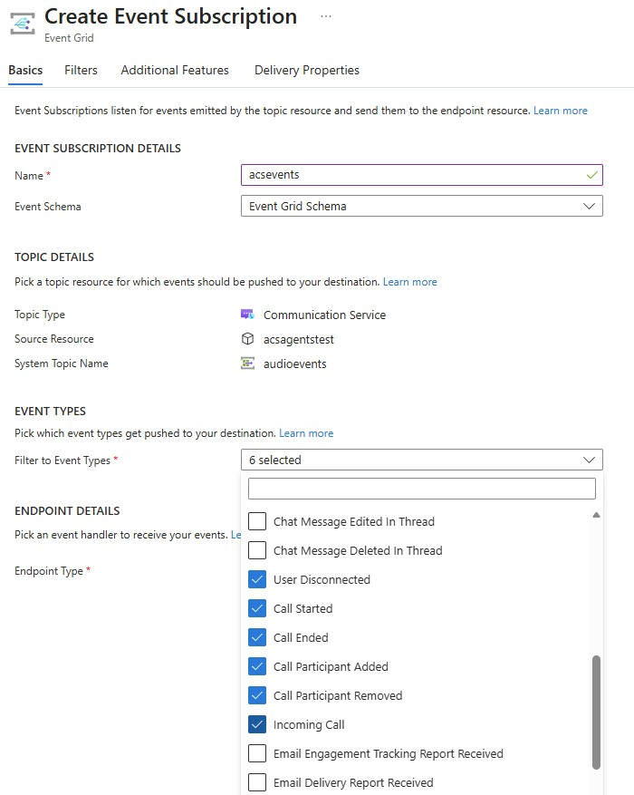
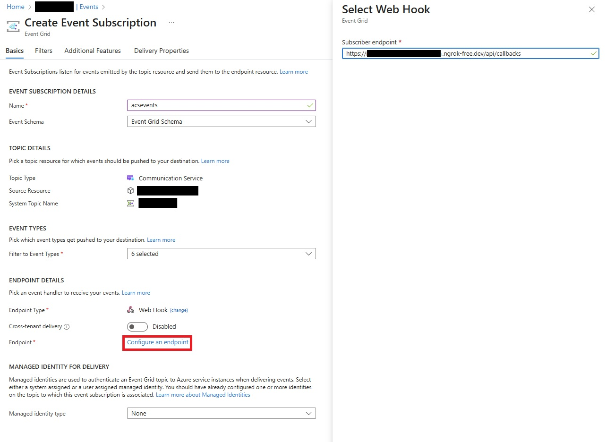

# Azure Communication Services (ACS) Setup Guide

This guide provides detailed instructions for setting up Azure Communication Services to enable phone call integration with your GPT Realtime Agents application.

## Overview

Azure Communication Services enables your AI application to handle PSTN phone calls. The architecture bridges phone calls to the Azure OpenAI Realtime API over WebSockets:

**Phone ↔ ACS ↔ WebSocket ↔ Python Backend ↔ WebSocket ↔ Azure OpenAI Realtime API**

## Prerequisites

- Active Azure subscription
- Azure Communication Services resource (created in this guide)
- Phone number purchased through ACS (covered below)
- For local development: ngrok or similar tunneling service

---

## Step 1: Create Azure Communication Services Resource

1. Navigate to the [Azure Portal](https://portal.azure.com)
2. Click **Create a resource** in the left sidebar
3. Search for **"Communication Services"** in the marketplace
4. Click **Create** on the Communication Services resource page

**Configuration:**
- **Subscription**: Select your Azure subscription
- **Resource group**: Create new or select existing
- **Resource name**: Choose a unique name (e.g., `my-acs-resource`)
- **Region**: Select a region close to your users
- **Data location**: Choose data residency location

5. Click **Review + Create**, then **Create**
6. Wait for deployment to complete (usually 1-2 minutes)

### Get Your Connection String

Once deployed:

1. Navigate to your ACS resource
2. Go to **Settings** → **Keys** in the left menu
3. Copy the **Primary connection string** - you'll need this for your application configuration

**Format**: `endpoint=https://<your-resource>.communication.azure.com/;accesskey=<your-access-key>`

---

## Step 2: Purchase and Configure a Phone Number

### Navigate to Phone Numbers

1. In your ACS resource, go to **Telephony and SMS** → **Phone numbers**
2. Click the **Get** button to start the purchase flow



### Select Phone Number Options

**Country/Region:**
- Select the country where you want your phone number
- Availability varies by region (US, Canada, UK, etc.)

**Number Type:**
- **Toll-free**: Recommended for customer-facing voice applications (no charge to callers)
- **Local**: Geographic phone numbers with area codes

**Capabilities:**
- Ensure **Voice** is supported
- You can also enable SMS if needed for your use case


### Complete Purchase

1. Click **Next** to search for available numbers
2. Select a phone number from the available options
3. Review pricing (monthly cost displayed)
4. Click **Buy now** to complete the purchase
5. Copy the purchased phone number in E.164 format (e.g., `+18005551234`)

### Test Your Phone Number

1. Go to **Telephony and SMS** → **Try Phone Calling**
2. Use the built-in testing feature to verify your number is working
3. Make a test call to ensure audio connectivity


---

## Step 3: Configure Event Grid for Callbacks

Event Grid enables your application to receive real-time notifications about call events (incoming calls, call status changes, etc.).

### Navigate to Events

1. In your ACS resource, go to **Events** in the left menu
2. Click **+ Event Subscription** to create a new subscription



### Configure Event Subscription

**Basic Settings:**
- **Name**: `acsevents` (or any descriptive name)
- **Event Schema**: **Event Grid Schema**

**Topic Details:**
- **Topic Type**: Communication Service (auto-selected)
- **Source Resource**: Your ACS resource (auto-populated)
- **System Topic Name**: `audioevents` (auto-generated)

**Event Types** - Select the events you need:
- ✅ **Incoming Call** - Triggered when receiving inbound calls
- ✅ **Call Started** - Call connection established
- ✅ **Call Ended** - Call disconnected
- ✅ **Call Participant Added** - Participant joined
- ✅ **Call Participant Removed** - Participant left
- ✅ **User Disconnected** - User dropped from call



**Endpoint Details:**
- **Endpoint Type**: **Web Hook**
- **Subscriber Endpoint**: Your application's callback URL
  - **Production**: `https://your-app-domain.com/api/callbacks`
  - **Local Development**: `https://your-ngrok-url.ngrok-free.app/api/callbacks`



### Important Notes

- Event Grid requires a **publicly accessible HTTPS endpoint**
- For local development, use ngrok to create a tunnel (see below)
- Azure will send a validation request to your endpoint when you create the subscription
- Your application must respond to validation requests correctly

---

## Step 4: Local Development with ngrok

When developing locally, Azure Communication Services needs to reach your local backend. ngrok creates a secure tunnel from a public URL to your localhost.

### Install and Configure ngrok

1. **Download ngrok**:
   - Visit [ngrok.com/download](https://ngrok.com/download)
   - Download the appropriate version for your OS

2. **Sign up for a free account**:
   - Create an account at [ngrok.com](https://ngrok.com)
   - Copy your authtoken from the dashboard

3. **Connect your account**:
   ```powershell
   ngrok config add-authtoken <your-auth-token>
   ```

### Start ngrok Tunnel

```powershell
ngrok http 8080
```

**Output will show:**
```
Forwarding  https://abc123.ngrok-free.app -> http://localhost:8080
```

### Update Your Configuration

Copy the forwarding URLs and update your `.env` file:

```env
# HTTP callback endpoint for Event Grid
CALLBACK_EVENTS_URI=https://abc123.ngrok-free.app/api/callbacks

# WebSocket endpoint for media streaming
CALLBACK_URI_HOST=wss://abc123.ngrok-free.app
```

**Important**: 
- Keep ngrok running while testing
- The URL changes each time you restart ngrok (unless you have a paid plan with reserved domains)
- Update your Event Grid webhook endpoint if the ngrok URL changes

---

## Configuration Summary

After completing all steps, you should have:

### From Azure Communication Services:

1. **Connection String** (from Settings → Keys):
   ```
   endpoint=https://your-resource.communication.azure.com/;accesskey=<key>
   ```

2. **Phone Number** (from Phone numbers):
   ```
   +18005551234
   ```

3. **Event Grid Subscription** (configured to your callback URL)

### Environment Variables to Set:

```env
# ACS Configuration
AZURE_ACS_CONN_KEY=endpoint=https://your-resource.communication.azure.com/;accesskey=<key>
ACS_PHONE_NUMBER=+18005551234

# Callback Configuration (for local dev with ngrok)
CALLBACK_EVENTS_URI=https://your-ngrok-url.ngrok-free.app/api/callbacks
CALLBACK_URI_HOST=wss://your-ngrok-url.ngrok-free.app

# Or for production deployment
CALLBACK_EVENTS_URI=https://your-app-domain.com/api/callbacks
CALLBACK_URI_HOST=wss://your-app-domain.com
```

---

## Testing Your Setup

### Test Outbound Calls

Use the backend API to initiate a test call (for local testing with no authentication):

```bash
curl -X POST https://your-backend-url/api/call \
  -H "Content-Type: application/json" \
  -d '{"number": "+1234567890"}'
```

### Test Inbound Calls

1. Call your ACS phone number from any phone
2. Your application should receive Event Grid notifications
3. The call should connect to the AI agent

### Verify in Azure Portal

1. Go to your ACS resource → **Monitor** → **Metrics**
2. Check for active calls and call duration
3. Review **Events** → **Event Subscriptions** → **Metrics** for webhook delivery status


---

## Production Deployment

For production deployments:

1. **Use Azure Container Apps or App Service** with a stable HTTPS endpoint
2. **Configure Event Grid webhook** with your production URL
3. **Enable managed identity** instead of connection string authentication
4. **Set up monitoring** with Application Insights
5. **Configure scaling** to handle call volume
6. **Review ACS pricing** and set up billing alerts

---

## Additional Resources

- [Azure Communication Services Documentation](https://learn.microsoft.com/azure/communication-services/)
- [ACS Phone Numbers Quickstart](https://learn.microsoft.com/azure/communication-services/quickstarts/telephony/get-phone-number)
- [Event Grid Event Schema for ACS](https://learn.microsoft.com/azure/event-grid/communication-services-voice-video-events)
- [ngrok Documentation](https://ngrok.com/docs)

---

## Cost Considerations

**Phone Numbers:**
- Monthly rental fee (varies by country/type)
- US Toll-free: ~$2/month
- US Local: ~$1/month

**Usage:**
- Inbound calls: Per-minute charges
- Outbound calls: Per-minute charges (varies by destination)
- Check [ACS Pricing](https://azure.microsoft.com/pricing/details/communication-services/) for details

**Recommendations:**
- Start with one phone number for testing
- Monitor usage in Azure Cost Management
- Set up billing alerts for unexpected charges
